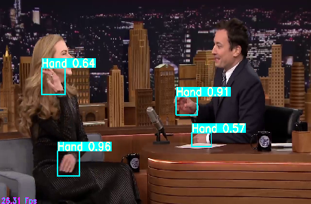

# YOLO V3
物体检测，包括手部检测、人脸检测、人检测、安全帽检测，交通工具检测，因为数据集的独立所以分别为5个独立模型。  

## 项目介绍    
### 1、手部检测  
手部检测示例如下 ：    
* 图片示例：  
    
* 视频示例：  
    

* 相关拓展应用的手的21关键点检测回归的项目地址：https://codechina.csdn.net/EricLee/handpose_x
* 手部检测+21点手关键点完整pipeline的项目地址：https://codechina.csdn.net/EricLee/dpcas
  
### 2、左右手检测
示例如下 ：      
* 视频示例：  
    

## 项目配置  
* 作者开发环境：  
* Python 3.7  
* PyTorch >= 1.5.1  

## 数据集   
### 1、手部检测数据集   
该项目数据集采用 TV-Hand 和 COCO-Hand (COCO-Hand-Big 部分) 进行制作。  
TV-Hand 和 COCO-Hand数据集官网地址 http://vision.cs.stonybrook.edu/~supreeth/   

* [该项目制作的训练集的数据集下载地址(百度网盘 Password: c680 )](https://pan.baidu.com/s/1H0YH8jMEXeIcubLEv0W_yw)   


### 2、左右手检测数据集
* 获取数据集地址 ： http://fouheylab.eecs.umich.edu/~dandans/projects/100DOH/  
### 所有数据集的数据格式  
size是全图分辨率， (x，y) 是目标物体中心对于全图的归一化坐标，w,h是目标物体边界框对于全图的归一化宽、高。   

```  
dw = 1./(size[0])  
dh = 1./(size[1])  
x = (box[0] + box[1])/2.0 - 1  
y = (box[2] + box[3])/2.0 - 1  
w = box[1] - box[0]  
h = box[3] - box[2]  
x = x*dw  
w = w*dw  
y = y*dh  
h = h*dh  
```  

为了更好了解标注数据格式，可以通过运行 show_yolo_anno.py 脚本进行制作数据集的格式。注意配置脚本里的path和path_voc_names，path为标注数据集的相关文件路径，path_voc_names为数据集配置文件。
### 制作自己的训练数据集
* 如下所示,每一行代表一个物体实例，第一列是标签，后面是归一化的中心坐标(x,y),和归一化的宽(w)和高(h)，且每一列信息空格间隔。归一化公式如上，同时可以通过show_yolo_anno.py进行参数适配后，可视化验证其正确性。
```
label     x                  y                   w                  h
0 0.6200393316313977 0.5939000244140625 0.17241466452130497 0.14608001708984375
0 0.38552491996544863 0.5855700073242187 0.14937006832733554 0.1258599853515625
0 0.32889763138738515 0.701989990234375 0.031338589085055775 0.0671400146484375
0 0.760577424617577 0.69422998046875 0.028556443261975064 0.0548599853515625
0 0.5107086662232406 0.6921500244140625 0.018792660530470802 0.04682000732421875
0 0.9295538153861138 0.67602001953125 0.03884511231750328 0.01844000244140625
```

## 预训练模型   
### 1、COCO 预训练模型  
* [预训练模型下载地址(百度网盘 Password: egdg )](https://pan.baidu.com/s/1KTvktMA38lsVYUjQ0sh5HQ)     

### 1、手部检测预训练模型    
* 包括yolo预训练模型图像输入尺寸416，yolo-tiny预训练模型图像输入尺寸为512。  
* [预训练模型下载地址(百度网盘 Password: 7mk0 )](https://pan.baidu.com/s/1hqzvz0MeFX0EdpWXUV6aFg)     

### 2、左右手检测-预训练模型
* [预训练模型下载地址(百度网盘 Password: 3ae7 )](https://pan.baidu.com/s/1aMXMKWe6ehHUBab2rJM3hg)   


## 项目使用方法     

### 数据集可视化    
* 根目录下运行命令： show_yolo_anno.py   (注意脚本内相关参数配置 )   

### 模型训练     
* 根目录下运行命令： python train.py     (注意脚本内相关参数配置 )   

* 注意：加载训练的配置参数的关键代码段如下，cfg/transport.data为训练coco交通工具数据集的配置参数文件。
```
if __name__ == '__main__':
    train(data_cfg = "cfg/transport.data")
```

* cfg文件夹下的 "*.data"文件包含了重要的配置信息，以"cfg/transport.data"为例如下：
```
cfg_model=yolo # 模型选择：yolo  / yolo tiny
classes=8 # 数据集的类别
gpus = 0 # GPU 的选择
num_workers = 8 # 训练时数据迭代（增强）器的进程数
batch_size = 8 # 训练时每一个批次的图片量设定，该例子是8张图片
img_size = 416 # 模型的默认输入图片尺寸是 416*416
multi_scale = True # 是否在训练中采用多尺度增强方式，该例子为使用
epochs = 100 # 训练总周期，完整遍历一次数据集为一个周期
train=./yolo_transport_train/anno/train.txt # 训练集的train.txt路径
valid=./yolo_transport_train/anno/train.txt # 验证集的train.txt路径，目前训练代码中并没有加入验证功能代码
names=./cfg/transport.names # 该数据集对应的具体分类名字，需要与其标签对应
finetune_model = ./weights-yolov3-transport/latest_416.pt # 采用的预训练模型
lr_step = 10,20,30 # 训练时对应的特定epoch时更新学习率
lr0 = 0.001 # 训练时的初始化学习率

```

### 模型推理    
* 根目录下运行命令： python predict.py   (注意脚本内相关参数配置  )  
